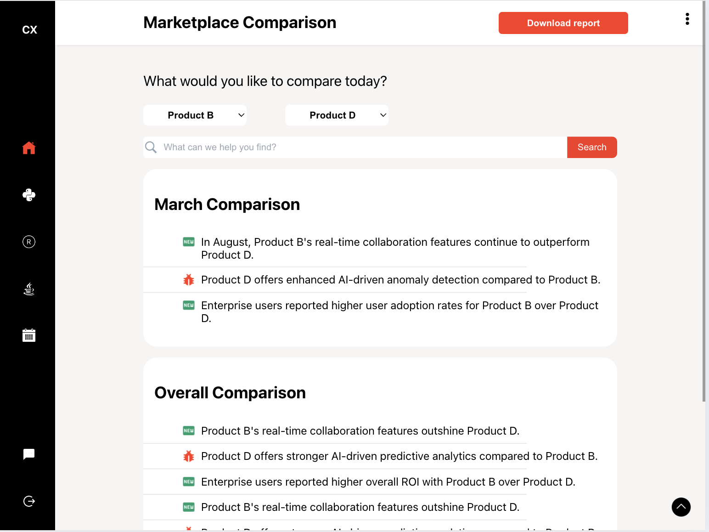

# Compare_X ( UI )

## Overview:
Running the above code locally generates a UI that looks like the below:

## Features:

| S.N | Required | Features | Description |
| ---- | ---- | ---- | ---- |
| 1 | Required | Month Search | Enter a month in the capitalised format ( eg: "January" without quotes ) in the search box to show monthly overall data for the entered month and for the selected products | 
| 2 | Required | Text Search | Enter any text ( apart from capitalised format of months ) to enable a text search in the current monthly and overall view |
| 3 | Required | Filter by Product | On initial load, the Select boxes are configured to compare Products A and B. Change the selection here to fetch data for two other products. Choosing the same Product renders an error message |
| 4 | Required | Monthly and Overall View | Based on the selection made on Products and Search box, the view should filter the search results. Product Selection overrides text search, but retains Month search |
| 5 | Bonus | Chat-bot | A chat-bot appears at the bottom right corner of the UI available on click of a button |
| 6 | Bonus | Side Nav Expand on hover | Side nav expands on hover in desktop view ( or click on tablet view ) and displays details of the navigation |
| 7 | Bonus | TopNav Download Report button implementation | Downloads a report on click |